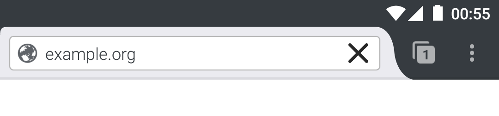
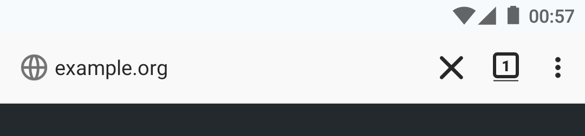
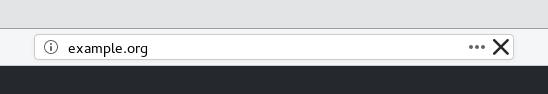

# What This Does

Add a button to the address bar that closes the current tab when clicked. Because closing tabs on mobile is a chore otherwise.

Get it from [addons.mozilla.org](https://addons.mozilla.org/en-US/firefox/addon/tab-close-webext/)

# Screenshots

### Firefox 55 for Android

  

### Firefox 57 for Android

  

### Firefox 57 on Desktop

  

# Known Bugs:

  - Button is hard to see (black on grey) in private/incognito tabs in Firefox Android. (Needs [bug 1267354](https://bugzil.la/1267354))
